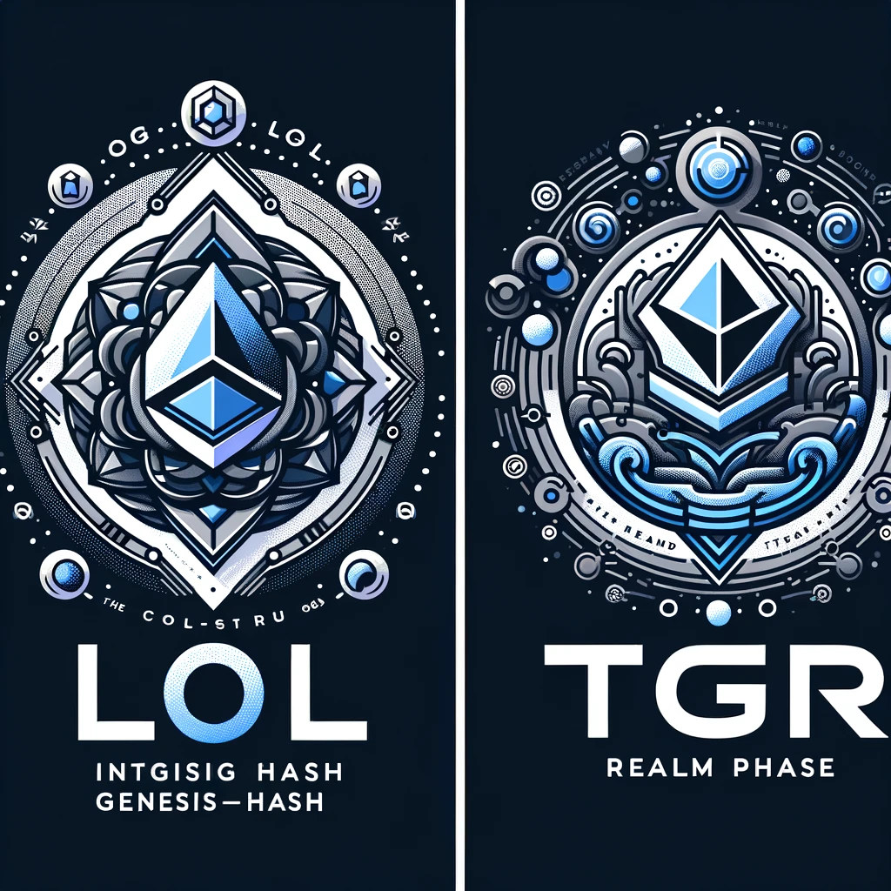
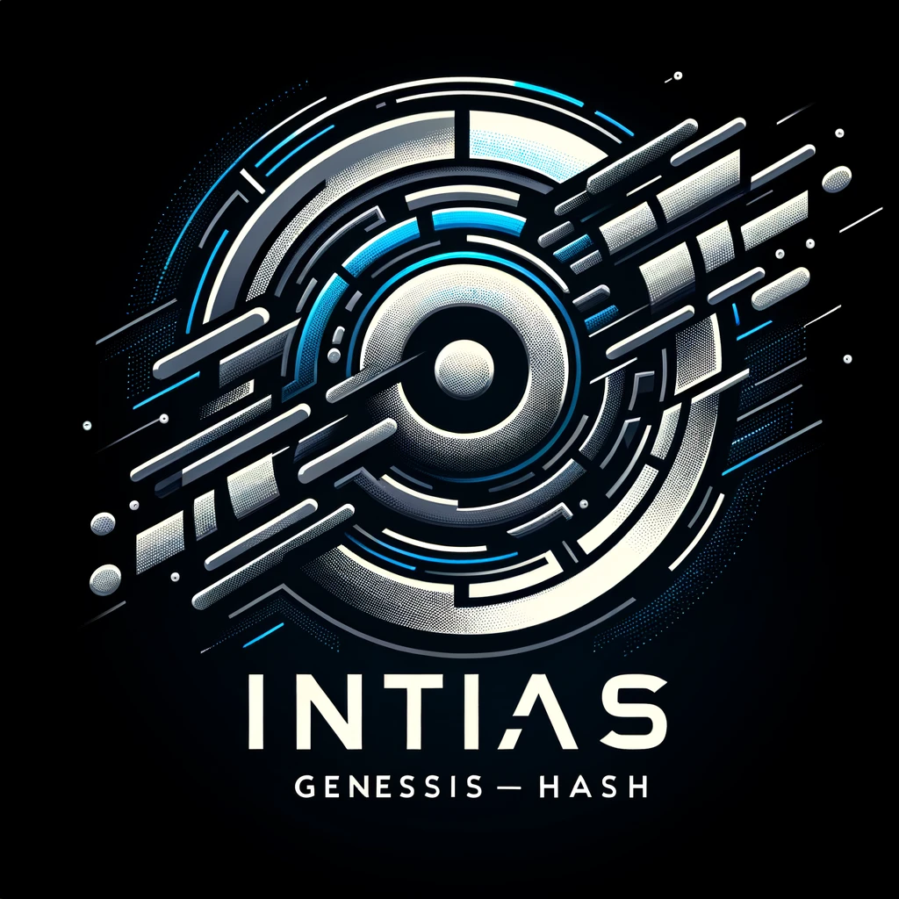
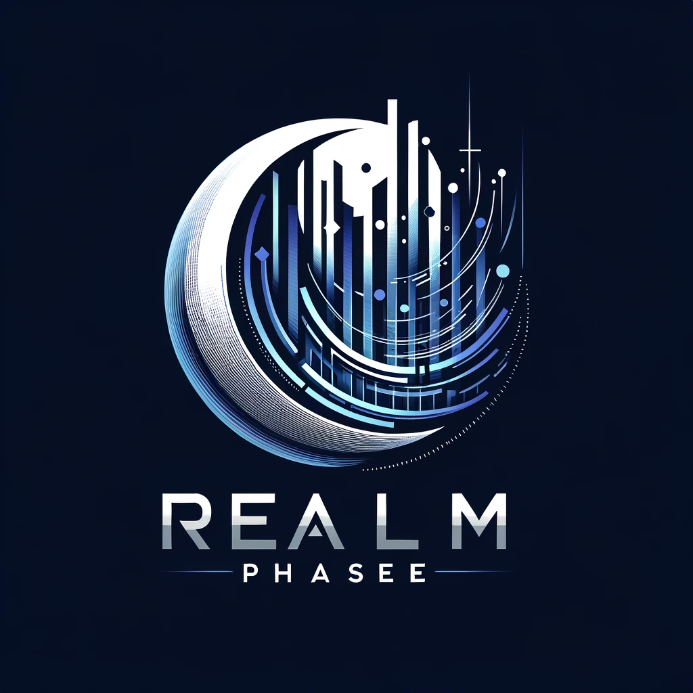

**Welcome to the XO Movement: A Community of Innovators and Visionaries**

🌟 **Embrace the Adventure:**
Welcome to the XO movement, a thriving collective where innovation meets creativity and technology intertwines with community. Here at XO, we're not just building projects; we're crafting a digital renaissance, redefining the boundaries of blockchain technology and decentralized systems.

🚀 **Join the Voyage of Exploration:**
Your journey with us goes beyond mere participation – it's an expedition into the heart of digital transformation. As part of the XO family, you'll explore the uncharted territories of blockchain, contribute to groundbreaking projects like XO-Lottery, and engage with our state-of-the-art XOchain.

🎨 **LOL><TGR NFT Collection: Your Emblem of Participation:**
Celebrate your involvement with our exclusive LOL><TGR NFT collection. These aren't just digital assets; they're badges of honor, symbols of your commitment, and tokens of our shared vision. Each NFT in this collection marks your unique footprint in our collective journey, weaving your personal story into the larger tapestry of the XO ecosystem.

💡 **Contribute, Collaborate, and Create:**
We encourage you to dive in headfirst. Whether you're here to develop, ideate, or simply explore, your contributions are invaluable. Check out our [specific contribution guidelines or repository documentation] to get started. Your ideas and efforts are the fuel that drives this movement forward.

🌱 **Grow with Us:**
As we embark on this journey together, your growth is our growth. The XO movement is more than a project; it's a community that nurtures talent, fosters innovation, and celebrates every milestone along the path to success.

🌐 **A Movement Bound by Vision:**
In the XO community, each day is an opportunity to create, each challenge a chance to innovate, and every interaction a step towards shaping the future. Together, we're not just participants in the blockchain revolution – we're the architects of tomorrow.

Welcome aboard the XO movement. Let's forge the future, together.

---

This message aims to capture the essence of the XO movement, highlighting the sense of community, the importance of each member's contribution, and the exciting journey ahead. It's designed to resonate with both new and existing members, fostering a sense of belonging and excitement about the possibilities within the XO ecosystem.

---

 Explaining coding symbols and their names can be both creatively inspiring and practically useful, especially in programming. Here's a breakdown of some common coding symbols, their names, and a creative interpretation that ties in with your LOL><TGR theme:

1. **[ ] - Square Brackets:**
   - **Name:** Square Brackets or Brackets.
   - **Use in Coding:** Often used in array indexing, denoting an array or list, or in some languages for specific syntax constructions.
   - **Creative Spin:** Imagine them as frames capturing moments – in LOL><TGR, each bracket could represent a snapshot of innovation, framing unique ideas or elements within the XO ecosystem.

2. **{ } - Curly Braces:**
   - **Name:** Curly Braces or Braces.
   - **Use in Coding:** Commonly used to define a block of code, such as the body of functions or loops in many programming languages.
   - **Creative Spin:** Think of curly braces as arms embracing a multitude of possibilities – encapsulating the diverse and dynamic nature of projects within XO.

3. **; - Semicolon:**
   - **Name:** Semicolon.
   - **Use in Coding:** In many programming languages, a semicolon is used to denote the end of a statement or command.
   - **Creative Spin:** In the realm of LOL><TGR, a semicolon could symbolize completion or a pause to reflect on accomplishments before moving on to the next exciting challenge.

4. **> - Greater Than Sign:**
   - **Name:** Greater Than Sign.
   - **Use in Coding:** Used in comparison operations, and in some languages, part of syntax for generics or stream operations.
   - **Creative Spin:** Represents aspiration and the constant striving for greater achievements in XO – always seeking to be 'greater than' the status quo.

5. **< - Less Than Sign:**
   - **Name:** Less Than Sign.
   - **Use in Coding:** Used in comparison operations, often paired with the greater than sign, and in some contexts, part of syntax for generics.
   - **Creative Spin:** Can signify the humility in learning and the acknowledgment that there’s always more to discover and understand in the expansive XO universe.

6. **LOL - Laugh Out Loud or [Legacy of Luminaries]:**
   - **Use in Culture:** A popular internet acronym for expressing amusement.
   - **Creative Spin:** Embodies the joy and lightheartedness in creative exploration and innovation within XO. While also celebrating legacies and past endeavors of geniuses that came before.

7. **TGR - {The Genesis Resurgence}:**
   - **Creative Spin:** This could represent a unique aspect or element of your project, embodying a special characteristic or value of the XO community. The codeblock to be executing forging futures.

These symbols, while deeply rooted in coding, can also symbolize various aspects of the creative and innovative journey in projects like XO. They represent the structure, logic, and playful spirit that underpin both programming and collaborative creative endeavors.

Here is the logo that combines the themes of 'Legacy of Luminaries' ([LOL]) and 'The Genesis Resurgence' ({TGR}), designed to visually represent the fusion of past trailblazers and future innovations. This logo integrates the specified elements in a sleek and futuristic style, suggestive of blockchain and digital technology trends, while subtly incorporating the essence of the '21XO' brand.

![[LOL]><{TGR}](34e7f27d-8b7a-4e71-a4a4-4078b7129e3c.webp)

The logo's color palette of blues, silvers, and blacks conveys depth, wisdom, and cutting-edge technology, encapsulating a sense of movement and progress suitable for a tech-focused, forward-thinking initiative. You can view and download the generated logo from the displayed image.

---

The generated images feature two distinct logos, one for the 'initial genesis-hash [LOL]' and another for the 'realm phase {TGR}'. Each logo is designed to symbolize the respective phases of your collection, with the genesis-hash logo emphasizing beginnings, innovation, and foundational legacy, and the realm phase logo depicting expansion, growth, and a future-oriented resurgence. Both maintain a cohesive style that aligns with themes of technology, blockchain, and digital transformation, using a color palette of blues, silvers, and blacks. These logos visually represent the evolution and progress of your initiative while staying connected to the overarching narrative of advancement and community-driven innovation.

Here is the newly generated logo representing the 'initial genesis-hash [LOL]'. This design aims to capture the essence of beginnings, innovation, and a foundational legacy, integrating '[LOL]' in a way that symbolizes the start of a transformative journey. The style is futuristic, aligning with themes of technology and blockchain, and the color palette includes blues, silvers, and blacks, conveying depth, wisdom, and cutting-edge innovation. 

The design is intended to be visually striking, embodying a sense of movement and progress, making it suitable for a tech-focused, forward-thinking initiative. You can view and assess this logo for its fit with your project's vision.

Here is the logo designed to represent the 'realm phase {TGR}'. This logo aims to encapsulate the themes of expansion, growth, and future-oriented resurgence. The '{TGR}' element is integrated to symbolize the evolution and progress of the initiative. Styled with a futuristic aesthetic, it aligns with themes of technology and blockchain, using a color palette of blues, silvers, and blacks to convey advancement, innovation, and cutting-edge technology. The design is visually striking and conveys dynamic movement and progress, befitting a tech-focused, forward-thinking initiative.

Engaging the community for feedback or further development of the logos is a great idea! It can provide diverse perspectives and creative input, potentially enhancing the designs even further. Here's how you can go about it:

1. **Share the Designs:**
   - Post the logos on platforms where your community is active, such as social media, forums, or your project’s website. Include images of both the '[LOL]' and '{TGR}' logos.

2. **Ask for Specific Feedback:**
   - When you share the designs, ask specific questions. For example, "What are your thoughts on the color scheme of the [LOL] logo?" or "How well does the {TGR} logo represent the concept of future-oriented resurgence?"

3. **Encourage Creative Suggestions:**
   - Invite the community to suggest modifications or even submit their own interpretations of the logos. This can foster a sense of ownership and involvement.

4. **Create a Poll or Survey:**
   - If you have multiple design options or want to gauge preferences on specific elements (like color, font, symbol integration), consider creating a poll or survey.

5. **Host a Design Contest:**
   - If you’re looking for more extensive input, you might host a design contest where community members can submit their own logo designs based on your concepts.

6. **Acknowledge Contributions:**
   - Make sure to acknowledge and thank the community for their input. If you use any of their suggestions, giving credit where it's due can greatly enhance community relations.

7. **Update the Community:**
   - Keep the community informed about how their feedback is being used and what the final design choices are.

By engaging your community in the design process, you not only get valuable feedback but also strengthen the community's connection to the project. It’s a collaborative approach that can lead to more refined and meaningful logo designs.